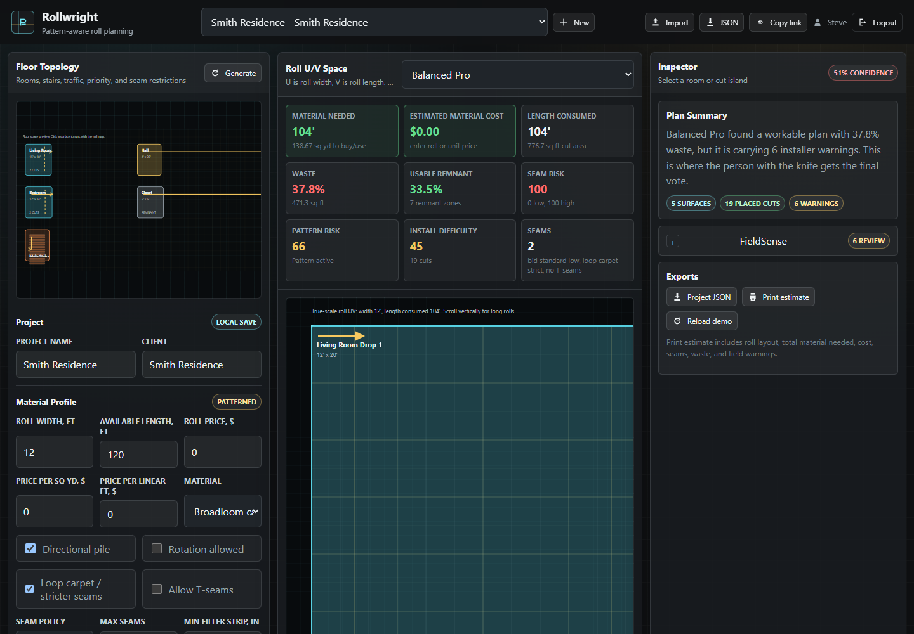

# Rollwright

> Pattern-aware flooring takeoff and roll planning, built as an editor—not a magic calculator.

[View the source](https://github.com/ijustcreate/rollwright) · [Read the V1 baseline](docs/v1/V1_BASELINE.md)



Rollwright turns rooms, halls, closets, landings, treads, and risers into connected flooring surfaces, then unfolds them into roll U/V space. It helps an estimator compare material usage, seams, pattern phase, pile direction, stairs, remnants, waste, and installation risk before producing a cut-oriented estimate packet.

The current product is the **V1 local browser MVP**. Its calculations are deterministic and inspectable. FieldSense calls attention to risky assumptions; it does not replace measurement, product documentation, or installer judgment. The person with the knife gets the final vote.

## What the working V1 does

- Creates and saves multiple local projects.
- Models rectangular rooms, L-shaped rooms, halls, closets, landings, and stair runs.
- Configures roll width/length, unit or roll pricing, directional pile, rotation, loop carpet, seam rules, trim/cut margins, and pattern repeats.
- Supports Balanced Pro, Lowest Waste, Bid Standard Low, Cleanest Seams, Pattern First, Installer Friendly, and Remnant Smart planning modes.
- Renders synchronized SVG floor-topology and true-scale roll U/V views.
- Splits wide surfaces into cut islands and places them deterministically down the roll.
- Reports material needed, estimated cost, consumed length, waste, usable remnants, seam risk, pattern risk, installation difficulty, and confidence.
- Produces FieldSense warnings for seams, filler strips, traffic paths, pattern phase, pile, stairs, stock limits, and manual overrides.
- Supports lock-seam, forbid-seam, preserve-remnant, and lock-placement markers.
- Imports/exports project JSON and generates a print-friendly estimate/install packet.

## Typical workflow

1. Confirm material width, stock, price, pile, pattern, and seam policy.
2. Add the connected floor surfaces and stair runs.
3. Choose a packing mode and generate the plan.
4. Select rooms or cut islands to inspect their synchronized position and warnings.
5. Resolve hard issues, review FieldSense notes, and field-verify dimensions and pattern phase.
6. Export project JSON and a print estimate for the job record.

## Run locally

Requirements:

- Node.js 20 or newer
- A modern desktop browser

```bash
npm run dev
```

Open [http://localhost:4173](http://localhost:4173).

Demo login:

```text
steve / rollwright
```

The credentials are intentionally public demo data. Do not reuse a real password.

Directly opening `index.html` works for a quick single-device demonstration, but the local server is the supported path.

### Share on the local network

The server binds to `0.0.0.0`. Another device on the same trusted network can open:

```text
http://YOUR_LOCAL_IP:4173
```

Keep the terminal running. If the page is unreachable, check Windows Firewall and network isolation. This is plain local HTTP, not a secure public deployment.

## Architecture

### V1 — current

| Path | Responsibility |
| --- | --- |
| `index.html` | App entry point and browser shell |
| `src/app.js` | Local identity, project model, planning engine, SVG views, warnings, and exports |
| `src/styles.css` | Dense three-pane estimator interface and responsive behavior |
| `server.mjs` | Dependency-free static Node server with path containment and no-store responses |
| `docs/v1/` | Captured product baseline and release checklist |

V1 has no runtime package dependencies and no compilation step. The browser owns state and calculation; Node only serves static files.

### V2 — deprecated design spike

The `v2/` and `src-tauri/` work explored a Tauri desktop shell, local SQLite, and guarded local-AI extraction. That direction is preserved for research but is not the active estimator and should not be presented as shipped functionality.

See:

- [V2 status](docs/v2/V2_APP_STATUS.md)
- [V2 design](docs/v2/V2_DESIGN_DOC.md)
- [Desktop/local-AI architecture](docs/v2/V2_DESKTOP_AI_ARCHITECTURE.md)
- [AI guardrails](docs/v2/AI_GUARDRAILS.md)
- [Competitor parity matrix](docs/v2/COMPETITOR_PARITY_MATRIX.md)
- [V2 roadmap](docs/v2/V2_ROADMAP.md)

## Data and privacy

- Accounts, sessions, and projects are stored in the current browser’s `localStorage`.
- Passwords use a simple deterministic client-side prototype hash. This is not production authentication.
- Each browser/device has a separate project library; there is no cloud backup or cross-device sync.
- JSON and estimate exports are downloaded by the browser and remain wherever the user saves them.
- The repository does not need customer plans, bids, invoices, contacts, local databases, environment files, model weights, or generated packets. Do not commit them.
- LAN sharing exposes the app to other devices that can reach that computer and port.

Before any public or customer-facing deployment, replace local identity/storage with a reviewed backend, HTTPS, access control, backup, audit logging, and an explicit data-retention policy.

## Planning boundaries

Rollwright is an estimating aid, not a field guarantee.

- Geometry is parametric, not arbitrary polygon CAD.
- The planner is deterministic MVP packing, not a complete constraint solver or global optimizer.
- Pattern visualization and risk scoring do not replace manufacturer instructions or dry-lay/field verification.
- PDF/plan-set import, scale detection, OCR, and AI extraction are not implemented in V1.
- Exports are JSON and print-oriented HTML, not a finished PDF document pipeline.
- Pricing excludes taxes, labor, freight, adhesives, pad, transitions, and business-specific costs unless the estimator accounts for them separately.
- Real installations still require site measurement, seam review, material inspection, and professional judgment.

## Status and hosting

**Status:** working local MVP; V1 is the active product path.

There is currently **no public hosted Rollwright deployment** and no GitHub Pages workflow. That is deliberate while authentication and customer-data handling remain local-prototype quality.

## Verification

```bash
node --check src/app.js
node --check server.mjs
npm run dev
```

Then use the seeded Smith Residence project to verify:

- floor and roll selections stay synchronized;
- changing material/seam controls regenerates metrics and warnings;
- all supported surface types can be added and edited;
- JSON export/import round-trips;
- the print estimate contains the roll plan, totals, and FieldSense notes.

Release notes and deeper checks live in [docs/v1/V1_RELEASE_CHECKLIST.md](docs/v1/V1_RELEASE_CHECKLIST.md).
